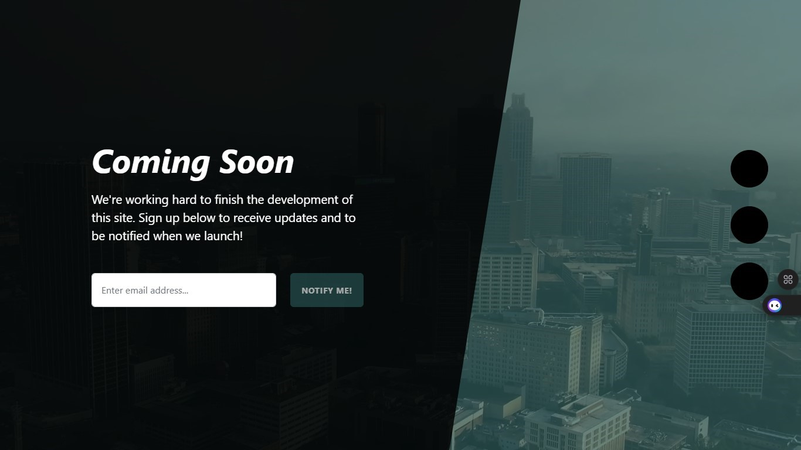

*Coming soon page design using bootsrap*

A cool coming soon page made with bootsrap ,fontawesome.it has a backgroound video here is the src code to archieve the same  

HTML code
      #Background Video
        <video class="bg-video" playsinline="playsinline" autoplay="autoplay" muted="muted" loop="loop"><source src=" Your source link" type="video/mp4" /></video>
        CSS code
        
        video.bg-video {
  position: fixed;
  top: 50%;
  left: 50%;
  min-width: 100%;
  min-height: 100%;
  width: auto;
  height: auto;
  transform: translateX(-50%) translateY(-50%);
  z-index: 0;
}

@media (pointer: coarse) and (hover: none) {
  body {
    background: url("../assets/img/bg-mobile-fallback.jpg") #2a5555 no-repeat center center scroll;
    background-size: cover;
  }
  body video {
    display: none;
  }
}

  
